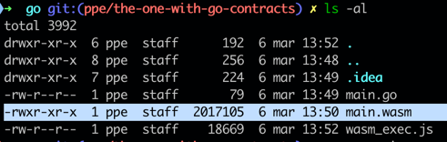

# Go smartweave example contract

Note: we're using `tinygo` compiler, as the default compiler produces huuuuge binaries 
(hello world example - ~2MB - probably because it adds all the WASI related stuff)

## How to use
- [Install tinygo](https://tinygo.org/getting-started/install/)
- Build wasm contract file: `bash build.sh` (it should create `pkg` folder)
- Run wasm contract simulation: `node wasm_exec_tiny.js out/main.wasm`

note: 
use wasm_exec.js from tinygo, not the defaut one from Go - https://github.com/tinygo-org/tinygo/issues/2484

note 2:
no support for decoding json in tinygo - https://github.com/tinygo-org/tinygo/issues/2660
