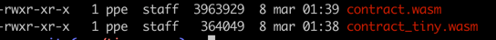

# Go smartweave example contract

## Install go 1.17
https://go.dev/doc/install

## How to use (default Go compiler)
- [Install easyjson](https://github.com/mailru/easyjson#install)
- Run `easyjson -all easyjson/easyjson.go`
- Build wasm contract file: `bash build.sh` (it should create `out` folder)
- Run wasm contract simulation: `node run.js`

## How to use (tinygo compiler)
- [Install tinygo](https://tinygo.org/getting-started/install/)
- [Install easyjson](https://github.com/mailru/easyjson#install)
- Run `easyjson -all easyjson/easyjson.go`
- Build wasm contract file: `bash build-tiny.sh` (it should create `out` folder)
- Run wasm contract simulation: `node run-tiny.js`

### Size comparison for PST contract (default go compiler vs `tinygo` compiler):  

### Folder structure
- `common` - package for commons code, that will be reused between contracts (
handles the low-level WASM-JS communication for Go). Contains `SwContract` interface
that has to implemented by contract developers.
- `common_types` - package for commons structs. Have to be a separate package, 
otherwise easyjson throws error during code generation
- `impl` - package that contains implementation of the given contract (i.e. implementation of the `SwContract`
interface)
- `types` - package that contains types specific to the contract that needs to be generated with easyjson
- `main.go` - main file - entry point to the wasm library.
